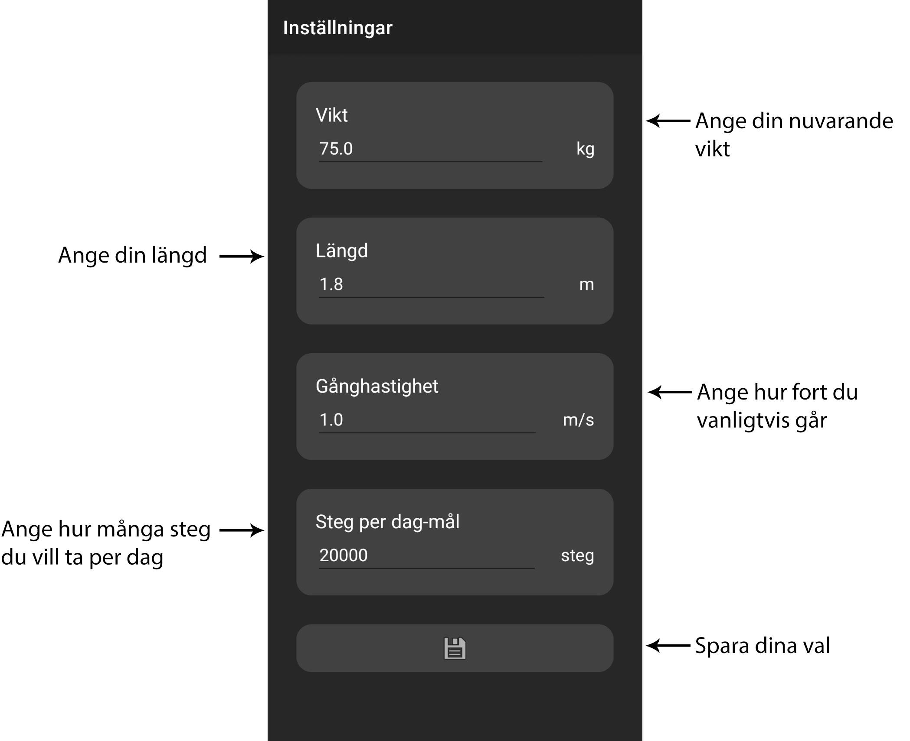

## App description

FitnessTracker allows you to keep track of your fitness goals and enables a healthy lifestyle with the following features:

- Step Counter: Keep track of your steps and monitor your progress towards your daily goal.

- Calorie Counter: See how many calories you've burned and how many you've consumed.

- Activity Insights: Get an overview of your weekly steps and the time you've spent sitting, walking, or running.

- Customized Information: Receive content tailored to you based on your physical characteristics and personal goals.

# Description of how to use the app

## Getting Started

Before using the app, activity recognition needs to be enabled. The next step is to open the app's settings by tapping the button at the bottom of the home screen, see Figure 1. Once opened, verify that the values are correct, and then save. To return to the home screen, use the back-swipe gesture.

## Using the app's automatic features

After taking a certain number of steps, the step count will not be updated. Instead, all steps taken during the day are reported the next day and appear in the week's diagram for the correct day. However, the steps will be updated on the same day they are taken, as well as the calories. Time reporting starts as soon as you open the app, and unless you move the phone, it will report all time as sedentary. When it moves, walking or running will be reported depending on how fast you move.

## Using the app's registration features

If an activity you've performed hasn't been reported, for example, when you haven't had your phone with you, you can manually register it by tapping the plus sign on the home screen and then tapping register activity. There, you fill in the type and duration, and after saving, this will be reflected in your reporting. Similarly, you can register meals, providing a better picture of your energy balance.

## Overview of the different screens

### Home Screen

*The app's home screen. Here, you get an overview of what you've accomplished today and throughout the week. Use any of the buttons at the top or bottom to navigate further.*

*The menu with registration options.*

### Settings

*The app's settings. Here, you fill in information about yourself so that the app's reporting is as accurate as possible.*

### Register Activity

*Register activity. It's important to choose one of the activity options.*

### Register Meal

*Register meal.*

# How the solution is built

The app contains the activities MainActivity, SettingsActivity, RegisterActivity, and RegisterMealActivity. MainActivity contains the view for the home screen that the user sees when opening the app. From here, they can see all information about their activities and open the other activities. In SettingsActivity, the user can choose values for parameters, which are then saved in the cache memory using SharedPreferences. These values are then loaded when MainActivity resumes and affect, among other things, calorie calculation. RegisterActivity saves the time for a specific activity performed in memory, which is then added to the weekly summary and converted into the number of steps and calories based on the user's parameters. RegisterMealActivity instead saves a certain number of calories, which are added to the daily energy balance.

The step counting uses the mobile sensor Sensor.TYPE_STEP_COUNTER to retrieve the number of steps taken since the last restart, and a listener is updated with this value as soon as it changes. To find out the number of steps for a specific day, this value is saved every day and compared with the previous day. The net value is converted into a bar height in the week's diagram, where the user's steps per day goal is also displayed.

The function that shows the time spent on different activities instead uses Sensor.TYPE_LINEAR_ACCELERATION. The listener uses the linear acceleration and compares this value with threshold values for walking or running and determines whether the user is moving or still. When a specific activity is identified, the time spent is counted during that time and added to them for the self-reported activities for the week.

*UML diagram of the app's components.*
